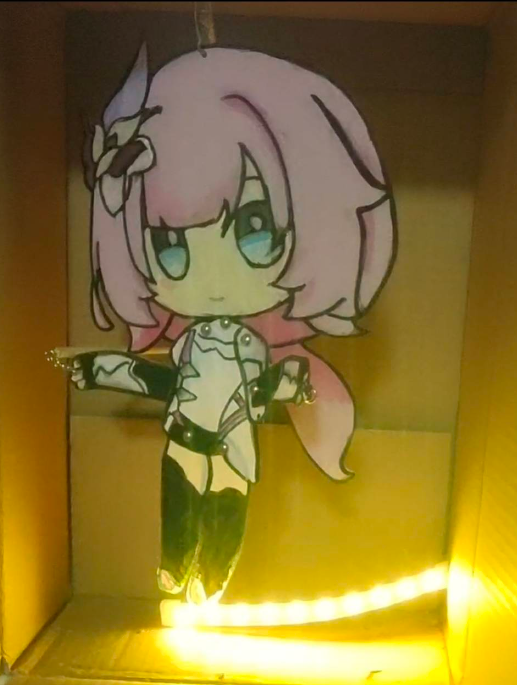
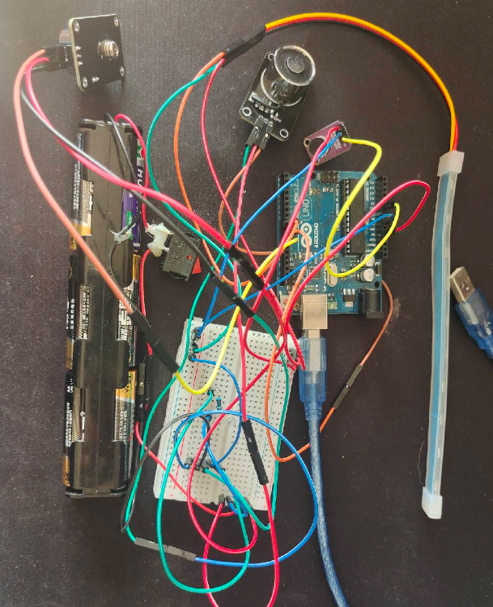

# 音乐律动皮影小人

Arduino音乐律动灯项目，通过FFT音频分析实现RGB灯带随音乐节拍变化，并联动电磁铁控制皮影小人按节奏跳舞。

## 功能特点

- 音频信号采集与FFT频谱分析
- 自动节拍检测
- RGB灯带颜色动态变化（低频→白色，中频→黄色，高频→粉色）
- 噪声过滤与信号增强
- **频率联动电磁铁控制**：根据音乐频段动态驱动电磁铁，控制皮影小人按节奏跳舞
  - 高频：同时驱动头部和手部电磁铁
  - 低频：主要驱动手部电磁铁
  - 中频：同时驱动头部和手部电磁铁

## 硬件要求

- Arduino开发板（如Arduino Uno）
- 麦克风模块（连接到A0引脚）
- WS2812B RGB灯带（10个灯珠，连接到9号引脚）
- 电磁铁 × 2（分别连接到10号和11号PWM引脚，6节电池独立供电）
- 皮影小人（包含可移动的头部和手部，由电磁铁驱动）

## 电路连接

| 组件 | Arduino引脚 | 说明 |
|------|-----------|------|
| 麦克风 | A0 | 音频输入 |
| RGB灯带 | Pin 9 | 数据信号 |
| 电磁铁1（头部） | Pin 10 | PWM输出，控制头部运动 |
| 电磁铁2（手部） | Pin 11 | PWM输出，控制手部运动 |
| 电池 | GND/VCC | 6节电池组（单独为电磁铁供电） |

## 依赖库

- [arduinoFFT](https://github.com/kosme/arduinoFFT) - FFT音频分析库
- [Adafruit_NeoPixel](https://github.com/adafruit/Adafruit_NeoPixel) - RGB灯带控制库

## 文件说明

- `new.ino` - 最新版本，包含RGB灯带和电磁铁联动控制

## 使用方法

1. 在Arduino IDE中安装所需依赖库
2. 连接硬件：
   - 麦克风 → A0
   - RGB灯带 → Pin 9
   - 电磁铁1 → Pin 10（头部，6节电池独立供电）
   - 电磁铁2 → Pin 11（手部，6节电池独立供电）
3. 上传代码到Arduino开发板
4. 播放音乐，灯带将随节拍闪烁变色，皮影小人将按节奏跳舞

## 工作原理

### 频域分析（频率 → 颜色）

- **低频（62-500Hz）**：鼓、贝斯 → 白色灯光 + 手部运动
- **中频（560-1250Hz）**：人声、吉他 → 黄色灯光 + 头手联动
- **高频（1310-1940Hz）**：女声、镲片 → 粉色灯光 + 头手联动

### 时域分析（节拍 → 触发）

通过检测音频信号的峰值-谷值差（Peak-to-Peak），识别音乐节拍。当检测到节拍时：

1. **灯光效果**：点亮RGB灯带（持续150ms）
2. **电磁铁驱动**：根据当前频段启动对应的电磁铁（持续200ms）
3. **冷却机制**：两次启动间隔至少500ms，避免过频驱动

## 参数调整

可根据实际效果调整以下参数（在代码中）：

| 参数 | 默认值 | 说明 |
|------|-------|------|
| `beatThreshold` | 80 | 节拍检测灵敏度，值越小越灵敏 |
| `minBeatInterval` | 300ms | 两次节拍的最小间隔 |
| `lightDuration` | 150ms | 灯光持续时间 |
| `magnetDuration` | 200ms | 电磁铁启动时长 |
| `magnetCooldown` | 500ms | 电磁铁冷却间隔 |
| `magnetPower` | 200 | 电磁铁功率（0-255） |

## 后记与改进方向

### 效果评价

作为学校科技节作品，该项目成功实现了RGB灯带与皮影小人的音乐同步表演。**灯光的亮度和节拍同步效果令人满意，色彩搭配与音乐节奏的对应关系也很好。**

### 存在的问题

电磁铁的吸附范围有限（**有效吸附距离仅为0.5-1cm**），即使配合杠杆原理，小人的动作幅度仍然较小，难以实现更富有表现力的舞蹈动作。

### 改进方案

**计划采用直流电机 + 曲柄摇杆机构替代电磁铁方案：**
- 直流电机提供持续的旋转动力，相比电磁铁的脉冲吸附更加灵活
- 曲柄摇杆机构能将旋转运动转换为较大幅度的往复直线运动
- 可实现更加逼真、流畅的舞蹈效果

## 项目照片

## 许可证

本项目采用开源许可证。
